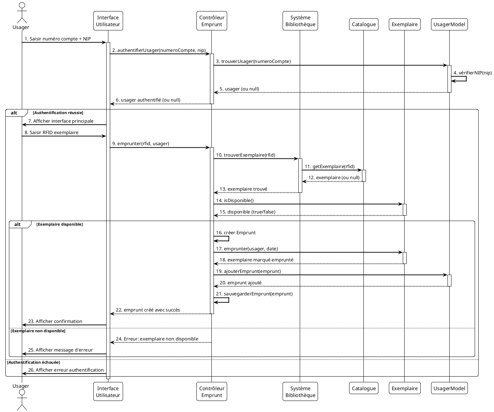
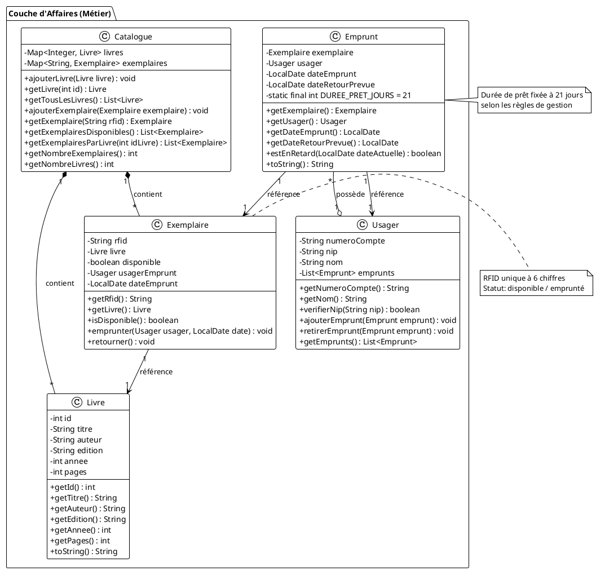

# LIVRABLE FINAL — PROJET SYSTÈME DE BIBLIOTHÈQUE

**Cours:** INF1163 - Modélisation et conception orientée objet  
**Université:** Université du Québec en Outaouais (UQO)  
**Équipe:** [À compléter]  
**Session:** [À compléter]  
**Date de soumission:** [À compléter]

---

Ce document rassemble les éléments textuels du livrable final demandés (à incorporer ensuite dans un seul fichier Word/PDF). Le code source Java et le fichier JAR sont fournis séparément dans le dépôt.

---

## TABLE DES MATIÈRES

1. [Cas d'utilisation « Emprunter documents »](#1-cas-dutilisation-emprunter-documents)
2. [Diagramme de Séquence Système (DSS)](#2-diagramme-de-séquence-système-dss)
3. [Diagramme des classes de la couche d'affaires](#3-diagramme-des-classes-de-la-couche-daffaires)
4. [Catalogue des documents](#4-catalogue-des-documents)
5. [Code source et fichier de distribution](#5-code-source-et-fichier-de-distribution)
6. [Instructions de compilation, d'exécution et d'utilisation](#6-instructions-de-compilation-dexécution-et-dutilisation)
7. [Dépendances et librairies](#7-dépendances-et-librairies)
8. [Annexe — Contribution des membres de l'équipe](#8-annexe--contribution-des-membres-de-léquipe)

---

## 1. CAS D'UTILISATION « EMPRUNTER DOCUMENTS »

### 1.1 Description générale

| **Élément** | **Description** |
|------------|----------------|
| **Identifiant** | CU-002 |
| **Nom** | Emprunter documents |
| **Acteur principal** | Usager |
| **Acteurs secondaires** | Système (acteur secondaire) |
| **Niveau** | Objectif utilisateur |
| **Portée** | Système de bibliothèque |

### 1.2 Préconditions

1. Le système est démarré et initialisé.
2. Les fichiers CSV (usagers.csv, livres.csv, exemplaires.csv) sont présents dans le dossier `data/`.
3. L'usager possède un compte valide dans le système.
4. L'usager connaît son numéro de compte et son NIP (4 chiffres).

### 1.3 Postconditions

1. Un objet `Emprunt` est créé et associé à l'usager.
2. L'exemplaire est marqué comme non disponible (emprunté).
3. L'emprunt est enregistré dans le fichier de log `data/emprunts.log`.
4. La date de retour prévue est calculée (date d'emprunt + 21 jours).

### 1.4 Scénario principal (flux nominal)

1. L'usager lance l'application.
2. L'usager saisit son numéro de compte dans l'interface.
3. L'usager saisit son NIP (4 chiffres) dans l'interface.
4. L'usager clique sur le bouton « Se connecter ».
5. Le système valide le numéro de compte et le NIP.
6. Le système authentifie l'usager et affiche l'interface principale.
7. L'usager saisit le RFID de l'exemplaire à emprunter (6 chiffres).
8. L'usager clique sur le bouton « Emprunter ».
9. Le système recherche l'exemplaire dans le catalogue par son RFID.
10. Le système vérifie que l'exemplaire existe et est disponible.
11. Le système crée un objet `Emprunt` avec la date actuelle.
12. Le système calcule la date de retour prévue (date actuelle + 21 jours).
13. Le système met à jour le statut de l'exemplaire (non disponible).
14. Le système associe l'emprunt à l'usager.
15. Le système enregistre l'emprunt dans le fichier de log.
16. Le système affiche un message de confirmation avec les détails de l'emprunt (titre du livre, date d'emprunt, date de retour prévue).

### 1.5 Scénarios alternatifs (extensions)

#### Extension 1.5.1 : Authentification échouée

**Point d'extension :** Étape 5 du scénario principal

1. Le système vérifie le numéro de compte et le NIP.
2. Le numéro de compte n'existe pas OU le NIP est incorrect.
3. Le système affiche un message d'erreur : « Numéro de compte ou NIP incorrect ».
4. L'usager peut réessayer de se connecter.
5. Le scénario reprend à l'étape 2 du scénario principal.

#### Extension 1.5.2 : Exemplaire non trouvé

**Point d'extension :** Étape 9 du scénario principal

1. Le système recherche l'exemplaire par RFID.
2. Aucun exemplaire ne correspond au RFID saisi.
3. Le système affiche un message d'erreur : « Exemplaire introuvable. Vérifiez le RFID. ».
4. L'usager peut saisir un autre RFID.
5. Le scénario reprend à l'étape 7 du scénario principal.

#### Extension 1.5.3 : Exemplaire non disponible

**Point d'extension :** Étape 10 du scénario principal

1. Le système vérifie la disponibilité de l'exemplaire.
2. L'exemplaire est déjà emprunté (non disponible).
3. Le système affiche un message d'erreur : « Cet exemplaire n'est pas disponible pour l'emprunt. ».
4. Le système peut proposer de consulter d'autres exemplaires du même livre (si disponibles).
5. L'usager peut choisir un autre exemplaire.
6. Le scénario reprend à l'étape 7 du scénario principal.

#### Extension 1.5.4 : Erreur lors de l'enregistrement

**Point d'extension :** Étape 15 du scénario principal

1. Le système tente d'enregistrer l'emprunt dans le fichier de log.
2. Une erreur d'entrée/sortie se produit (fichier verrouillé, disque plein, etc.).
3. Le système affiche un message d'avertissement : « L'emprunt a été effectué mais l'enregistrement a échoué. ».
4. L'emprunt reste valide en mémoire.
5. Le scénario se termine avec un message de confirmation partielle.

### 1.6 Règles métier associées

- **RM-004 :** L'authentification d'un usager se fait par la combinaison unique du numéro de compte et du NIP. Le NIP doit contenir exactement 4 chiffres.
- **RM-005 :** Chaque exemplaire possède un identifiant RFID unique composé de 6 chiffres.
- **RM-006 :** La durée maximale d'un prêt est fixée à **21 jours** à partir de la date d'emprunt.
- **RM-007 :** Un exemplaire peut être emprunté uniquement s'il est disponible (statut = disponible).

## 2. DIAGRAMME DE SÉQUENCE SYSTÈME (DSS)

Le diagramme de séquence système suivant illustre les interactions entre les différents composants lors de l'emprunt d'un document.

### 2.1 Code PlantUML



### 2.2 Description des interactions

Le diagramme de séquence montre le flux d'exécution complet du cas d'utilisation « Emprunter documents » :

1. **Authentification (étapes 1-6) :** L'usager saisit ses identifiants, le système vérifie et authentifie l'usager.

2. **Recherche de l'exemplaire (étapes 8-13) :** Le système recherche l'exemplaire par RFID dans le catalogue.

3. **Vérification de disponibilité (étapes 14-15) :** Le système vérifie si l'exemplaire est disponible.

4. **Création de l'emprunt (étapes 16-21) :** Si disponible, le système crée l'emprunt, met à jour l'exemplaire, associe l'emprunt à l'usager et sauvegarde.

5. **Confirmation (étapes 22-23) :** Le système confirme l'emprunt à l'usager.

### 2.3 Notes techniques

- Les diagrammes PlantUML peuvent être rendus en images PNG, SVG ou PDF à l'aide de l'outil PlantUML (disponible sur http://www.plantuml.com/ ou via l'extension VS Code).
- Le fichier source du diagramme est disponible dans `docs/diagrams/emprunter_sequence.puml`.

## 3. DIAGRAMME DES CLASSES DE LA COUCHE D'AFFAIRES

Le diagramme suivant présente uniquement les classes de la couche d'affaires (métier), conformément aux exigences. Les classes de la couche de présentation (UI) ne sont pas représentées.

### 3.1 Code PlantUML



### 3.2 Description des classes

#### Catalogue
Classe principale gérant l'ensemble des livres et exemplaires de la bibliothèque. Elle maintient deux collections : `livres` (Map associant l'identifiant du livre à l'objet Livre) et `exemplaires` (Map associant le RFID de l'exemplaire à l'objet Exemplaire).

#### Livre
Représente un livre dans le catalogue. Contient les informations bibliographiques : titre, auteur, édition, année de publication, nombre de pages.

#### Exemplaire
Représente un exemplaire physique d'un livre. Chaque exemplaire possède un RFID unique et peut être emprunté par un usager. Attributs principaux : `rfid` (identifiant RFID unique à 6 chiffres), `livre` (référence au livre correspondant), `disponible` (statut de disponibilité).

#### Usager
Représente un usager de la bibliothèque. Chaque usager possède un numéro de compte unique et un NIP pour l'authentification.

#### Emprunt
Représente un emprunt d'un exemplaire par un usager. Contient les dates d'emprunt et de retour prévue. La durée de prêt est fixée à 21 jours selon les règles de gestion.

### 3.3 Relations entre les classes

- **Catalogue → Livre** : Relation de composition (1..*). Le catalogue contient plusieurs livres.
- **Catalogue → Exemplaire** : Relation de composition (1..*). Le catalogue contient plusieurs exemplaires.
- **Exemplaire → Livre** : Relation de référence (1..1). Chaque exemplaire référence un livre.
- **Emprunt → Exemplaire** : Relation de référence (1..1). Chaque emprunt référence un exemplaire.
- **Emprunt → Usager** : Relation de référence (1..1). Chaque emprunt référence un usager.
- **Usager → Emprunt** : Relation d'agrégation (1..*). Un usager peut avoir plusieurs emprunts.

### 3.4 Notes techniques

- Le fichier source du diagramme est disponible dans `docs/diagrams/couche_affaires_classes.puml`.
- Les diagrammes peuvent être rendus en images à l'aide de PlantUML.

## 4. CATALOGUE DES DOCUMENTS

Le catalogue suivant présente tous les livres disponibles dans le système avec leurs exemplaires. Les données sont extraites des fichiers `data/livres.csv` et `data/exemplaires.csv`.

### 4.1 Catalogue complet

| ID | Titre | Auteur | Édition | Année | Pages | Nb exemplaires | RFIDs des exemplaires |
|:---:|------|--------|---------|:-----:|:-----:|:---------------:|----------------------|
| 1 | Introduction à la programmation | Robert Bouchard | 3ème | 2020 | 450 | 2 | 123456, 234567 |
| 2 | Analyse et conception orientée objet | Sylvie Moreau | 2ème | 2019 | 580 | 2 | 345678, 444444 |
| 3 | Bases de données relationnelles | Pierre Desjardins | 4ème | 2021 | 620 | 2 | 456789, 567890 |
| 4 | Algorithmes et structures de données | Marie-Claire Lévesque | 1ère | 2020 | 520 | 2 | 678901, 555555 |
| 5 | Architecture des ordinateurs | Jean-François Dufour | 5ème | 2019 | 480 | 1 | 789012 |
| 6 | Intelligence artificielle | Lucie Beaulieu | 1ère | 2022 | 680 | 2 | 890123, 901234 |
| 7 | Sécurité informatique | André Côté | 2ème | 2021 | 550 | 1 | 012345 |
| 8 | Réseaux et télécommunications | Isabelle Parent | 3ème | 2020 | 600 | 1 | 111111 |
| 9 | Ingénierie logicielle | Thomas Gagnon | 2ème | 2021 | 590 | 1 | 222222 |
| 10 | Gestion de projets informatiques | Valérie Dubois | 1ère | 2022 | 510 | 1 | 333333 |

**Total :** 10 livres, 15 exemplaires

### 4.2 Répartition des exemplaires

- **Livres avec 2 exemplaires :** Livres 1, 2, 3, 4, 6 (5 livres)
- **Livres avec 1 exemplaire :** Livres 5, 7, 8, 9, 10 (5 livres)

### 4.3 Format des données

Les données sont stockées dans deux fichiers CSV :

1. **`data/livres.csv`** : Format `id,titre,auteur,edition,annee,pages`
2. **`data/exemplaires.csv`** : Format `rfid,idLivre`

Ces fichiers sont compatibles avec Microsoft Excel et peuvent être modifiés manuellement si nécessaire.

## 5. CODE SOURCE ET FICHIER DE DISTRIBUTION

### 5.1 Code source Java

Le code source Java est organisé selon une architecture en couches et se trouve dans le dossier `src/main/java/com/bibliotheque/`.

#### 5.1.1 Structure des packages

```
com.bibliotheque/
├── Main.java                    # Point d'entrée de l'application
├── model/                       # Couche métier (affaires)
│   ├── Catalogue.java
│   ├── Livre.java
│   ├── Exemplaire.java
│   ├── Usager.java
│   └── Emprunt.java
├── dao/                         # Accès aux données
│   └── GestionnaireFichiers.java
├── controller/                  # Couche contrôleur
│   └── ControleurEmprunt.java
├── system/                      # Système principal
│   └── SystemeBibliotheque.java
└── ui/                          # Interface utilisateur (non incluse dans le diagramme de classes)
    └── InterfaceUtilisateur.java
```

#### 5.1.2 Documentation du code

Toutes les classes Java sont documentées avec des commentaires Javadoc. Chaque classe contient :
- Une description de la classe et de son rôle.
- Des commentaires pour les méthodes publiques importantes.
- Des explications pour les constantes et règles métier.

**Exemple de documentation :**

```java
/**
 * Classe représentant un emprunt d'un exemplaire par un usager.
 * La durée de prêt est fixée à 21 jours selon les règles de gestion.
 */
public class Emprunt {
    private static final int DUREE_PRET_JOURS = 21;
    // ...
}
```

#### 5.1.3 Conventions de codage

Le code respecte les conventions Java standard :
- Nommage en camelCase pour les variables et méthodes.
- Nommage en PascalCase pour les classes.
- Utilisation de constantes pour les valeurs fixes.
- Encapsulation des attributs (private avec getters/setters).
- Gestion des exceptions appropriée.

### 5.2 Fichier de distribution JAR

Le fichier de distribution `bibliotheque.jar` contient toutes les classes compilées et peut être exécuté directement.

#### 5.2.1 Création du fichier JAR

Le fichier JAR est créé à l'aide du script `creerJar.ps1` (PowerShell) ou `creerJar.bat` (Windows). Le script :
1. Compile les fichiers Java source.
2. Crée le fichier JAR avec le manifest approprié.
3. Place le fichier `bibliotheque.jar` à la racine du projet.

#### 5.2.2 Contenu du JAR

Le fichier JAR contient :
- Toutes les classes compilées (`.class`) organisées selon la structure des packages.
- Le fichier `MANIFEST.MF` spécifiant la classe principale (`com.bibliotheque.Main`).

#### 5.2.3 Exécution du JAR

Le fichier JAR peut être exécuté de deux manières :
1. En ligne de commande : `java -jar bibliotheque.jar`
2. Par double-clic (si l'association Java est configurée dans le système d'exploitation).

## 6. INSTRUCTIONS DE COMPILATION, D'EXÉCUTION ET D'UTILISATION

### 6.1 Prérequis

#### 6.1.1 Logiciels requis

- **Java JDK 8 ou supérieur** (recommandé : JDK 11+)
  - Téléchargement : https://www.oracle.com/java/technologies/downloads/
  - Vérification de l'installation : `java -version` et `javac -version` dans un terminal

#### 6.1.2 Fichiers requis

- Les fichiers CSV doivent être présents dans le dossier `data/` :
  - `data/usagers.csv`
  - `data/livres.csv`
  - `data/exemplaires.csv`

### 6.2 Compilation

#### 6.2.1 Méthode 1 : Utilisation d'un IDE (recommandé)

1. **Ouvrir le projet dans un IDE** (Eclipse, IntelliJ IDEA, NetBeans, VS Code)
2. **Configurer le JDK** dans les paramètres du projet
3. **Compiler le projet** :
   - Eclipse : Menu `Project` → `Build Project` (ou `Ctrl+B`)
   - IntelliJ IDEA : Menu `Build` → `Build Project` (ou `Ctrl+F9`)
   - NetBeans : Menu `Run` → `Build Project` (ou `F11`)
4. Vérifier qu'aucune erreur de compilation n'apparaît

#### 6.2.2 Méthode 2 : Compilation en ligne de commande

**Windows (PowerShell ou CMD) :**

```powershell
# Se placer dans le dossier racine du projet
cd C:\Users\claud\Downloads\MODELISATION2

# Compiler tous les fichiers Java
javac -d build -sourcepath src/main/java src/main/java/com/bibliotheque/**/*.java
```

**Note :** Si la compilation échoue avec une erreur de chemin, compiler fichier par fichier ou utiliser un IDE.

#### 6.2.3 Méthode 3 : Création du JAR (distribution)

**Windows :**

```powershell
# Utiliser le script PowerShell fourni
.\creerJar.ps1
```

**Ou manuellement :**

```powershell
# Compiler d'abord (voir Méthode 2)
# Créer le fichier JAR
cd build
jar cvfe ..\bibliotheque.jar com.bibliotheque.Main com
cd ..
```

### 6.3 Exécution

#### 6.3.1 Méthode 1 : Depuis un IDE

1. Ouvrir la classe `Main.java` dans l'IDE
2. Exécuter la classe :
   - Eclipse : Clic droit sur `Main.java` → `Run As` → `Java Application`
   - IntelliJ IDEA : Clic droit sur `Main.java` → `Run 'Main.main()'`
   - NetBeans : Clic droit sur `Main.java` → `Run File`

#### 6.3.2 Méthode 2 : En ligne de commande (classes compilées)

```powershell
# Depuis le dossier racine du projet
java -cp build com.bibliotheque.Main
```

#### 6.3.3 Méthode 3 : Exécution du fichier JAR

```powershell
# Depuis le dossier racine du projet
java -jar bibliotheque.jar
```

**Note :** Assurez-vous que le dossier `data/` est présent à côté du fichier JAR lors de l'exécution.

### 6.4 Utilisation du système

#### 6.4.1 Démarrage

1. Lancer l'application (voir section 6.3)
2. L'interface graphique s'ouvre automatiquement
3. Le système charge les données depuis les fichiers CSV
4. Un message de confirmation s'affiche dans la console (si exécution en ligne de commande)

#### 6.4.2 Connexion d'un usager

1. **Saisir le numéro de compte** dans le champ prévu (exemple : `100001`)
2. **Saisir le NIP** (4 chiffres, exemple : `1234`)
3. **Cliquer sur le bouton « Se connecter »**
4. Si l'authentification réussit, l'interface principale s'affiche
5. Si l'authentification échoue, un message d'erreur s'affiche

**Données de test disponibles :**
- Numéro de compte : `100001`, NIP : `1234` (Jean Dupont)
- Numéro de compte : `100002`, NIP : `5678` (Marie Tremblay)
- Autres usagers : voir `data/usagers.csv`

#### 6.4.3 Emprunt d'un document

1. **Saisir le RFID de l'exemplaire** (6 chiffres, exemple : `123456`)
2. **Cliquer sur le bouton « Emprunter »**
3. Si l'emprunt réussit :
   - Un message de confirmation s'affiche avec les détails de l'emprunt
   - Les informations incluent : titre du livre, date d'emprunt, date de retour prévue
4. Si l'emprunt échoue :
   - Un message d'erreur s'affiche (exemplaire introuvable, non disponible, etc.)

**RFIDs disponibles pour test :**
- `123456`, `234567` (Introduction à la programmation)
- `345678`, `444444` (Analyse et conception orientée objet)
- Voir le catalogue complet (section 4) pour tous les RFIDs

#### 6.4.4 Consultation des emprunts

1. **Cliquer sur le bouton « Consulter mes emprunts »** (si disponible dans l'interface)
2. La liste des emprunts actifs de l'usager connecté s'affiche
3. Chaque emprunt affiche : titre du livre, date d'emprunt, date de retour prévue

### 6.5 Dépannage

#### 6.5.1 Erreur : "Fichier CSV introuvable"

**Cause :** Les fichiers CSV ne sont pas dans le dossier `data/` ou le chemin est incorrect.

**Solution :**
- Vérifier que le dossier `data/` existe à la racine du projet
- Vérifier que les fichiers `usagers.csv`, `livres.csv`, `exemplaires.csv` sont présents
- Si exécution depuis un autre répertoire, s'assurer que le chemin relatif est correct

#### 6.5.2 Erreur : "ClassNotFoundException"

**Cause :** Les classes ne sont pas compilées ou le classpath est incorrect.

**Solution :**
- Recompiler le projet (voir section 6.2)
- Vérifier que le dossier `build/` contient les fichiers `.class`
- Vérifier le classpath lors de l'exécution

#### 6.5.3 Erreur : "Erreur lors du démarrage du système"

**Cause :** Erreur lors du chargement des données CSV (format incorrect, données manquantes, etc.).

**Solution :**
- Vérifier le format des fichiers CSV (voir section 4.3)
- Vérifier que les fichiers CSV contiennent des données valides
- Consulter les messages d'erreur dans la console pour plus de détails

## 7. DÉPENDANCES ET LIBRAIRIES

### 7.1 Librairies standard Java

Le projet utilise uniquement les librairies standard de Java (JDK), aucune librairie externe n'est requise :

- **java.lang** : Classes de base (String, Object, etc.)
- **java.util** : Collections (List, Map, HashMap, etc.)
- **java.time** : API de gestion des dates (LocalDate)
- **java.nio.file** : Gestion des fichiers (Paths, Files)
- **javax.swing** : Interface graphique (JFrame, JPanel, JButton, etc.)

### 7.2 Aucune dépendance externe

**Aucune librairie externe non standard n'est utilisée dans ce projet.**

Le projet est conçu pour être autonome et ne nécessite aucune installation supplémentaire au-delà du JDK Java.

### 7.3 Outils optionnels (non requis pour l'exécution)

Les outils suivants sont optionnels et peuvent être utiles pour le développement :

- **PlantUML** : Pour générer les diagrammes UML à partir des fichiers `.puml`
  - URL : http://www.plantuml.com/
  - Extension VS Code : "PlantUML" par jebbs
  - Fichier JAR : `plantuml.jar` (fourni dans le projet)

**Note :** PlantUML n'est pas nécessaire pour compiler ou exécuter l'application. Il est uniquement utilisé pour générer les diagrammes UML de la documentation.

## 8. ANNEXE — CONTRIBUTION DES MEMBRES DE L'ÉQUIPE

Cette section doit être complétée par l'équipe avec les contributions réelles de chaque membre.

### 8.1 Format de contribution

Pour chaque membre, indiquer :
- **Nom complet**
- **Tâches réalisées** (détaillées)
- **Fichiers/classes développés**
- **Responsabilités spécifiques**

### 8.2 Modèle de tableau

| **Membre** | **Contribution détaillée** |
|------------|---------------------------|
| **Membre 1**<br>(Prénom Nom) | • Analyse des exigences et conception du système<br>• Développement des classes métier (Livre, Exemplaire, Usager, Emprunt, Catalogue)<br>• Création du diagramme de classes de la couche d'affaires<br>• Documentation des classes Java |
| **Membre 2**<br>(Prénom Nom) | • Implémentation du GestionnaireFichiers (chargement CSV)<br>• Développement du ControleurEmprunt et logique métier<br>• Gestion de la persistance des emprunts (fichier de log)<br>• Tests et validation du système |
| **Membre 3**<br>(Prénom Nom) | • Conception et développement de l'interface utilisateur Swing<br>• Intégration de l'interface avec le système<br>• Gestion des événements utilisateur<br>• Tests de l'interface graphique |
| **Membre 4**<br>(Prénom Nom) | • Rédaction des cas d'utilisation détaillés<br>• Création du diagramme de séquence système (DSS)<br>• Rédaction de la documentation complète<br>• Création du fichier JAR et packaging<br>• Préparation du livrable final |

### 8.3 Notes sur la collaboration

- Tous les membres ont participé aux révisions de code et aux tests.
- Les décisions de conception ont été prises collectivement.
- La répartition des tâches a été effectuée selon les compétences et intérêts de chaque membre.

---

## CONCLUSION

Ce livrable final présente l'ensemble des éléments demandés pour le projet de système de bibliothèque :

✅ **Cas d'utilisation détaillé** : Le cas d'utilisation « Emprunter documents » est documenté avec tous les scénarios et extensions.

✅ **Diagrammes UML** : Le diagramme de séquence système (DSS) et le diagramme de classes de la couche d'affaires sont fournis en format PlantUML.

✅ **Catalogue** : Le catalogue complet des documents est présenté sous forme tabulaire avec tous les exemplaires et leurs RFIDs.

✅ **Code source documenté** : Le code Java est organisé, documenté avec Javadoc et respecte les conventions de codage.

✅ **Fichier de distribution** : Le fichier JAR `bibliotheque.jar` permet l'exécution directe de l'application.

✅ **Instructions complètes** : Les instructions de compilation, d'exécution et d'utilisation sont détaillées pour permettre à une tierce personne d'utiliser le système.

✅ **Documentation des dépendances** : Aucune dépendance externe n'est requise, uniquement le JDK Java standard.

Le système est fonctionnel, bien documenté et prêt à être évalué. Tous les éléments du livrable final sont présents et conformes aux exigences du cours INF1163.

---

**Fin du document**

*Ce document doit être converti en format Word (.docx) ou PDF (.pdf) pour la soumission finale. Le code source Java et le fichier JAR doivent être fournis séparément.*

### Remarques finales

- Ce fichier `Livrable_final.md` contient tout le texte exigé. Pour produire le PDF/Word final :
  - Convertir `Livrable_final.md` en PDF via `pandoc` :

```powershell
pandoc Livrable_final.md -o Livrable_final.pdf --pdf-engine=xelatex
```

  - Ou ouvrir le Markdown dans Word/VS Code et exporter en PDF.

- Le code source Java est dans `src/main/java/com/bibliotheque/` ; le JAR est produit par `creerJar.ps1` ou `creerJar.bat`.


